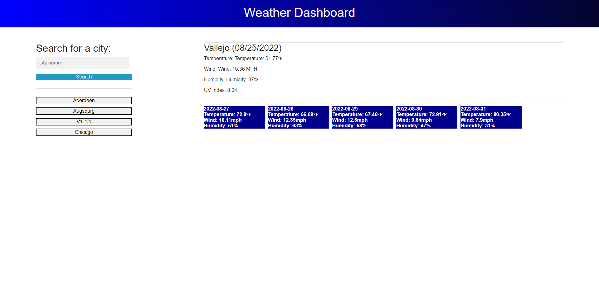

# jupiter-marvel-weather-dash

## Purpose

The goal of this project was to implement OpenWeather API calls to fetch weather data that might be pertinent to someone planning a trip or otherwise needing to quickly access weather facts about places other than where they may currently be. As such, it was important to make sure that all reasonably useful data was displayed in such a way as to make it understandable at a glance.

## OpenWeather API

Be advised that as this project was being developed, OpenWeather is in the process of consolidating many of its older API services into a new unified "OneCall 3.0", which will be very convenient if this app is updated in the future with access to it, but currently getting everything to work required various calls and consulting documentation from several different generations of OpenWeather APIs, some of which are either deprecated or in the process of being mothballed. Aside from resulting in some eccentricities in the code (which I have tried to explain in comments where possible), this may also result in unpredictable behavior in the future if the current fetch urls are changed or shut down.

### Deployed Site

https://shanep42.github.io/jupiter-marvel-weather-dash/